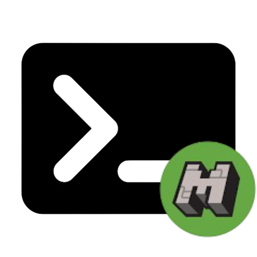

# TerminalCraft 

       

### Usage

* Clone repo / Install Client.py
* Run the following command
```Python
python client.py
```
> REQUIREMENTS.TXT NOT NEEDED unless you use client_2.py.

<sup> To change the IP, port, username or bot settings, modify the constants at the top of the file. </sup>

###### Client Alternative

> client_2.py is depricated!

For a better input system and colors in the terminal, but harder to read and modify code, use client_2.py.
This file needs the dependency ``prompt_toolkit==3.0.51``

### Latest Updates

| Update |
|------------|
| Added Color Maping on [``client.py``](/client.py) |
| Fixed Formating on [``client.py``](/client.py) |
| Made [``client_2.py``](/client_2.py) depricated |

### Contributors 💙

| Name |
|------------|
| YawningCheese99 |
| golden |
| CliffGuy |

#### Tasks / To-Do

##### golden’s tasks
- [x] make formatting correct - color code
- [ ] support for proxie / proxie list from file
- [ ] modularised / librarie conversion
- [ ] logo

##### YawningCheese99's tasks
-- 
